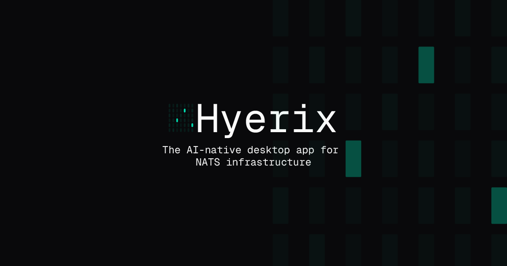

<p align="center">
  
</p>

# Hyerix

**Hyerix is an AI-native desktop GUI for NATS infrastructure.**

> [!IMPORTANT]
> **Launching today on Product Hunt.** Vote, comment, or share feedback: [producthunt.com/products/hyerix](https://www.producthunt.com/products/hyerix)

<p align="center">
  <a href="https://hyerix.ai">Website</a> &nbsp;·&nbsp;
  <a href="https://docs.hyerix.ai">Docs</a> &nbsp;·&nbsp;
  <a href="https://hyerix.ai#download">Download</a> &nbsp;·&nbsp;
  <a href="https://hyerix.ai/pricing">Pricing</a> &nbsp;·&nbsp;
  <a href="https://x.com/hyerixAI">X</a>
</p>

<p align="center">
  
  &nbsp;
  <a href="https://docs.hyerix.ai"></a>
  &nbsp;
  
</p>

---

Hyerix is a **NATS GUI** and **NATS desktop app** for operators who run JetStream in production. It surfaces streams, consumers, KV buckets, object stores, services, and cluster topology in one window — and pairs that view with Signal AI, a natural-language query layer that answers questions about live cluster state.

If you have been juggling `nats` CLI flags, `jq` pipelines, Prometheus panels, and a folder of `.conf` files, Hyerix folds all of it into one workspace.

## Why Hyerix

**The problems operators keep hitting:**

- The `nats` CLI is powerful but fragmented — answering "which consumers are lagging right now?" takes four commands and a pipe to `jq`.
- JetStream state lives in a dozen places: stream info, consumer info, `$SYS` events, server `/varz`, advisories. Correlating them by hand is slow and error-prone.
- Config drift and silent misconfiguration (retention mismatches, under-replicated streams, wrong ack policies) only show up when something breaks.

**How Hyerix resolves them:**

- A unified **JetStream dashboard** for every NATS surface — streams, consumers, KV buckets, object stores, services, and cluster topology — with live refresh and in-place editing.
- Signal AI ingests server stats, JetStream advisories, and `$SYS` events, then answers questions like *"why is this consumer falling behind?"* with a concrete diagnosis, not a generic doc link.
- Built-in config validation, anomaly detection, and slow-consumer diagnostics that flag problems before they page you.

## What's inside

| Capability | Description |
|---|---|
| **Streams & JetStream** | Create, edit, inspect, and tail streams and consumers through a unified interface. A real JetStream workspace, not a terminal loop. |
| **KV & Object stores** | Browse keys, view revision history, search across buckets, and inspect stored objects with payload previews. |
| **Services & topology** | Discover NATS micro-services and visualize cluster nodes and routes on an interactive React Flow graph. |
| **Signal AI** | Ask *"which streams have the most pending messages?"* or *"show me consumers that are lagging"* and get answers from live cluster state. |
| **Config validation** | Static checks for retention policy mismatches, replica counts, and resource limits before you apply. |
| **Real-time monitoring** | Time-series metrics from server stats and JetStream advisories, with automatic downsampling. |
| **Anomaly detection** | Isolation-forest and rule-based detectors that surface slow consumers, stalled streams, and lag regressions. |
| **Root cause analysis** | Guided diagnostic flows for the common JetStream failure patterns surfaced by monitoring and Signal AI. |
| **Connection manager** | Per-cluster credentials encrypted at rest with AES-GCM, exportable to portable `.hyerix` files, importable from `nats` CLI contexts. |
| **Local Signal AI** | Runs against a local Ollama runtime by default, or your own OpenAI key. When using Ollama, credentials and payloads never leave your machine. |

## Quick Start

Download the installer for your platform at **[hyerix.ai#download](https://hyerix.ai?utm_source=github&utm_medium=readme&utm_campaign=public-repo#download)**:

- **macOS** — universal `.dmg` (Apple Silicon + Intel), notarized and stapled
- **Windows** — signed `.msi` installer (x64)
- **Linux** — `.AppImage`, `.deb`, and `.rpm` (x64)

Launch the app, click **Start 14-Day Trial** on the welcome screen, and connect to your first cluster. No signup, no credit card, no account creation. Paid plans and license management live at [control.hyerix.ai](https://control.hyerix.ai); pricing is on [hyerix.ai/pricing](https://hyerix.ai/pricing?utm_source=github&utm_medium=readme&utm_campaign=public-repo).

## Signal AI in 30 seconds

Signal AI is the natural-language query layer. It reads live cluster state — not static docs — and answers with concrete numbers pulled from the server you are connected to.

Three prompts that work on day one:

1. `which consumers are lagging behind the stream head?`
2. `show me streams approaching their max_bytes limit`
3. `why is ORDERS_EU falling behind ORDERS_US?`

A typical Signal AI response *(illustrative)*:

```text
> which consumers are lagging?

3 consumers have num_pending > 1000:

  ORDERS.processor           pending: 4821   ack_floor: 18372   delivered: 23193
  ORDERS.archiver            pending: 2104   ack_floor: 21089   delivered: 23193
  PAYMENTS.fraud-check       pending: 1337   ack_floor:  9412   delivered: 10749

ORDERS.processor has the largest backlog. Its ack wait is 30s and 14 messages
are currently redelivering — likely a downstream timeout rather than consumer
throughput. Check the subscriber's processing latency.
```

Under the hood Signal AI routes ~80% of queries through a deterministic harness (instant, offline), and falls back to a BAML-structured LLM path for the long tail. See the [nats-top alternative comparison](https://docs.hyerix.ai/compare/vs-nats-top) for the full side-by-side.

## Try it against a realistic cluster in 60 seconds

No NATS cluster handy? Spin up a 3-node JetStream stack with realistic streams, consumers, KV, and a deliberately broken consumer — purpose-built to give Signal AI something to diagnose immediately:

```bash
git clone https://github.com/hyerix/hyerix-demo-cluster
cd hyerix-demo-cluster
docker compose up -d
```

Then open Hyerix, import the included `.hyerix/demo-cluster.hyerix` connection file, and ask Signal AI *"why is ORDERS.fraud-check falling behind?"*. See the full walkthrough at **[github.com/hyerix/hyerix-demo-cluster](https://github.com/hyerix/hyerix-demo-cluster)**.

Already have your own cluster? Hyerix reads a portable `.hyerix` connection file (JSON, no credentials by default) and supports `nats context` import directly from the connection manager — your existing `~/.config/nats/context/` contexts are pulled in with auth preserved.

## Documentation

Full documentation lives at **[docs.hyerix.ai](https://docs.hyerix.ai)**.

| Guide | What's in it |
|---|---|
| [Getting Started](https://docs.hyerix.ai/getting-started/quickstart) | Install, connect to your first cluster, and run your first Signal AI query. |
| [Signal AI Overview](https://docs.hyerix.ai/signal-ai/overview) | Prompt patterns, local Ollama setup, and how Signal AI grounds answers in live state. |
| [Incident Response Playbook](https://docs.hyerix.ai/guides/incident-response) | Diagnose slow consumers, investigate lag, validate configs, and plan capacity. |
| [Reference](https://docs.hyerix.ai/reference) | `.hyerix` file format, keyboard shortcuts, telemetry, and the full settings surface. |

## FAQ

**Is Hyerix open source?**
Hyerix is a commercial desktop application. This repository hosts the canonical project page for developers — not the app's source. You can start a 14-day trial with one click from the app, no signup required.

**How much does Hyerix cost?**
The full 14-day trial is free with no credit card. After trial, paid plans start at $19/month per user. See [hyerix.ai/pricing](https://hyerix.ai/pricing?utm_source=github&utm_medium=readme&utm_campaign=public-repo) for current tiers.

**How is this different from `nats-top`, `nats-box`, or web UIs?**
Hyerix is a native desktop app with editable state, live metrics, config validation, and an AI query layer grounded in live cluster data. It is built to be the tool you keep open all day, not a terminal you tail for ten seconds. See the full [nats-top comparison](https://docs.hyerix.ai/compare/vs-nats-top) for the side-by-side.

**Does Signal AI send my cluster data to OpenAI?**
Only if you configure an OpenAI key. The default path uses local inference via Ollama, so prompts, payloads, and telemetry stay on your machine. Credentials are stored in the OS keychain either way.

**Does Hyerix support Synadia Cloud?**
Yes. Any NATS endpoint that speaks the standard client protocol — self-hosted clusters, [Synadia Cloud](https://docs.hyerix.ai/compare/vs-synadia-console), leaf nodes, or a local dev stack — works the same way. Bring your credentials and connect.

**Which platforms are supported?**
macOS (Apple Silicon and Intel), Windows x64, and Linux x64. Hyerix is a Tauri-based native build — no Electron.

## Related projects

Hyerix is built on the shoulders of the NATS ecosystem. If you work with NATS you probably already know these:

- [nats-io/nats-server](https://github.com/nats-io/nats-server) — the NATS server and JetStream implementation
- [nats-io/nats.go](https://github.com/nats-io/nats.go) — official Go client
- [nats-io/nats.rs](https://github.com/nats-io/nats.rs) — official Rust client (Hyerix uses `async-nats` from this repo)
- [nats-io/nack](https://github.com/nats-io/nack) — JetStream controllers for Kubernetes

## Download Hyerix

Start the 14-day trial — no signup, no credit card.

**→ [hyerix.ai#download](https://hyerix.ai?utm_source=github&utm_medium=readme&utm_campaign=public-repo#download)**

macOS · Windows · Linux · [Pricing](https://hyerix.ai/pricing) · [Docs](https://docs.hyerix.ai) · [@hyerixAI](https://x.com/hyerixAI)

---

<sub>Hyerix <code>/ˈhaɪ.rɪks/</code> — rhymes with "high tricks".</sub>
